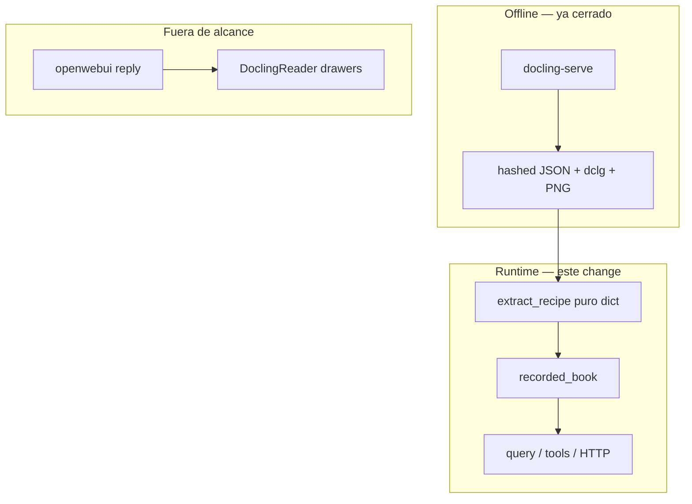

# Runtime JSON book (follow-ups post max-docling-parse)

**Estado:** listo para SDD. Un change OpenSpec `runtime-json-book`, tres fases.

**Decisión de alcance:** book / `extract_recipe` / `query` / HTTP claims / tools **sin** paquete Docling. **No** se saca `DoclingReader` de [`reply.py`](src/claimledger/openwebui/reply.py) ni `retrieval` de la imagen Docker en este change (gap explícito / follow-up).

## Tesis

```text
docling-serve     = Document Compiler   (offline; ya hecho)
CLAIMLEDGER       = Verification Kernel
hashed JSON       = SoT para recipe + query
```

Tras este change, el camino `load` → `extract_recipe` → `recorded_book` → `query` no importa `docling` / `docling_core` / `torch`.



## Fase A — extract_recipe puro JSON

**Hoy** ([`extract.py`](src/claimledger/ingest/extract.py)):

- `_body_tables` → `DoclingDocument.iterate_items` + pin/`torch`
- `_grid_from_table_data` → `TableData.grid` si falta `data.grid`

**Corpus actual:** tablas tienen `data.grid` y `table_cells`; `body` / `furniture` son nodos con `children`.

**Después:**

| Pieza | Comportamiento |
|-------|----------------|
| Body tables | Recorrer `payload["body"]` (children + groups anidados); resolver refs `#/tables/N` (o `self_ref`); **no** entrar a `furniture` |
| Grid | Usar solo `data.grid` si es lista no vacía |
| Sin grid | `IngestError` (serve escribe grid; no reimplementar span expansion) |
| Pin / torch | Eliminar `PINNED_DOCLING`, `_require_pinned_docling`, `_load_pinned_docling` |

**Spec delta** `docling-ingest` — requisito *Native Table Grid and Body List*:

- Body list = walk local del JSON, no `iterate_items`
- Grid = stored grid only; no `TableData` / no pin in-process
- Gold numbers unchanged; no module-level `docling` import

**Tests (Strict TDD):**

- RED: payload sintético con furniture table + body table → solo body produce claims
- RED/GREEN: extract sources no contienen `docling`, `docling_core`, `torch`, `PINNED_DOCLING`
- GREEN: `tests/ingest/test_extract.py`, `test_ground.py`, gold recipe rows

## Fase B — Runtime JSON book

**Contrato:**

- `recorded_book` / `query` / agent tools / HTTP claims no requieren Docling instalado para el camino recipe
- Cache hit de `load_or_convert`: no llama serve (ya)
- Compose: `claimledger` **sin** `depends_on: docling-serve` (ya); artifacts montados RO

**Tests:**

- Import scan: módulos `ingest/extract`, `ingest/ground`, kernel — no `docling`
- `recorded_book` + `query` verified sobre artifacts recompilados (smoke local opcional; pytest con fixtures existentes)

**Dockerfile / imagen:**

- **No** quitar `.[retrieval]` en este change (`reply` sigue usando drawers)
- Documentar en design/archive: gap = RAG drawers aún tiran de DoclingReader

## Fase C — CI / extras

**[`pyproject.toml`](pyproject.toml):**

```toml
ingest = [
    "httpx==0.28.1",
]
docling = [
    "docling==2.130.0",
    "docling-graph==1.9.1",
]
deepseek = [
    "httpx==0.28.1",
]
```

Quitar `httpx` del extra `docling` (pasa a `ingest`). Convert client / tests mock usan `ingest`.

**[`.github/workflows/pytest.yml`](.github/workflows/pytest.yml):**

| Job | Sync | Pytest |
|-----|------|--------|
| Kernel | `dev` | sin cambio |
| Product without Docling | `dev` + `http` | http/card/chart/…; añadir extract/ground que ya no importan docling si no abren PDF de corpus |
| Ingest / graph / retrieval | `dev` + `ingest` + `docling` + `retrieval` + `http` (+ deepseek si openwebui) | `tests/ingest` `tests/graph` `tests/retrieval` `tests/crop` `tests/openwebui` |

`convert_local` tests: mock HTTP → solo necesitan `httpx` (`ingest`), no wheel `docling`.

## Out of scope

- Quitar retrieval / DoclingReader de Open WebUI reply o de la imagen
- VLM / fase 10
- `auditoria-stack-nativo`
- Cambiar gold / recipe row set
- Redis / async serve

## Criterio de done

- `extract_recipe` sin imports Docling; body walk + grid only
- Spec `docling-ingest` alineada
- Book/query path docling-free (tests de import)
- Extra `ingest` + CI jobs correctos
- Full pytest verde; gold intacto
- Gap reply/retrieval documentado como follow-up

## Implementación

1. OpenSpec SDD completo para `runtime-json-book`
2. Apply Fase A → B → C (TDD)
3. Verify + archive; `AGENTS.md` Active change: none
