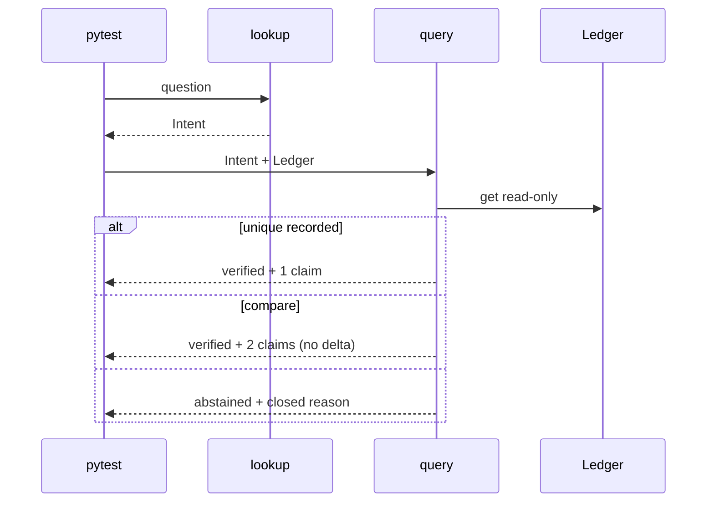

# Design: Fase 0 deterministic Financial Claims kernel

## Technical Approach

Closed architecture (`docs/fase-0.md`; specs identity, ledger, lookup, query, gold-regression). Docs-only repo: create seven kernel modules, evals, pytest. No new layers, HTTP, or Docling. Seed 14 recipe rows; query never parses.

## Architecture Decisions

| Option | Tradeoff | Decision |
|--------|----------|----------|
| Thin `Ledger` over `dict[str, FinancialClaim]` | Isolated test books | **Choose** |
| Module-level dict | Leaks gold state | Reject |
| Repository / Protocol / ABC | Invents a store layer | Reject (Architecture Gate) |
| Exact 7 modules | 1:1 with 8-commit TDD | **Choose** |
| Collapse to `models.py`+`kernel.py` | Mixes TDD slices | Reject |
| Extra files (`intent.py`, `seed.py`, adapters) | Invents structure | Reject |
| Frozen dataclasses + `validate_*` | Stdlib; Claimprint pattern | **Choose** |
| Pydantic | Extra pin | Reject |
| Bare dicts | Cannot enforce key vs fields | Reject |
| Port Claimprint `store.py` | Disk extract cache, not a book | Reject |
| Claim `verification_status` (rector §7) | Mixes ingest with query | Reject — `ledger_status` only |
| Press/deck identity | Out of Fase 0 | Reject — `recipe_no_extract` |
| Compare subtracts | Fase 9 | Reject — two claims only |

## Data Flow

Fase 0 skips PDF → Docling → Adapter. Recipe seed stands in for ingest.

```
recipe rows → Evidence + Claim → Ledger.upsert
  same id+value → append evidence, recorded
  same id+other value → conflicted, keep both
```

Rector §23 query (pytest caller, no HTTP):



`rejected` is unused neighbor, not a return. Query does not mutate the book.

## File Changes

All **Create**. Product modules are the seven `src/claimledger/*.py` files below (plus empty `__init__.py` marker).

| File | Action | Description |
|------|--------|-------------|
| `pyproject.toml` | Create | `>=3.11`, pytest; pins declared, not imported |
| `src/claimledger/__init__.py` | Create | Package marker |
| `src/claimledger/identity.py` | Create | key, aliases, `fold`, period |
| `src/claimledger/digits.py` | Create | `digits_ars`, `signed_ars` |
| `src/claimledger/evidence.py` | Create | Frozen evidence; bbox 0–1 |
| `src/claimledger/claim.py` | Create | Frozen claim + `validate_claim` |
| `src/claimledger/ledger.py` | Create | `Ledger` dict; upsert/get; recipe rows |
| `src/claimledger/lookup.py` | Create | `Intent`; no press/deck identity |
| `src/claimledger/query.py` | Create | `QueryResult`; no mutation |
| `evals/{aliases,identity_v1,identity_v2}.json` | Create | Alias table; 45+26; numbers frozen |
| `tests/test_{identity,ledger,lookup,query}.py` | Create | Unit: key, upsert, phrases, neighbor |
| `tests/test_gold_{v1,v2}.py` | Create | Seed harness; skip `na-*`; no-docling scan |

No `conftest.py`. No `import docling`.

## Interfaces / Contracts

Key is five fields including `statement`. Claim stores `ledger_status`, not rector §7 `verification_status`.

```
identity_key = f"{issuer}|{period}|{statement}|{scope}|{metric}"
FinancialClaim.ledger_status ∈ {recorded, conflicted}
Intent in lookup.py; QueryResult in query.py
QueryResult.status ∈ {verified, abstained}
reason ∈ {off_corpus, recipe_no_extract, no_matching_claim,
          incomplete_comparison, ambiguous_period, unresolved_identity}
```

`Ledger._book: dict[str, FinancialClaim]`. Same key+value appends evidence; other value → `conflicted` without overwrite. Prior `22362983` is not current `net_income`.

## Testing Strategy

Strict TDD. RED must fail for the right reason. Refactor only while green.

| Step | RED | GREEN |
|------|-----|-------|
| 1 | Import; pins unused | `pyproject.toml` + empty 7 modules |
| 2 | `test_identity.py` | `identity.py` + `digits.py` |
| 3 | Claim/evidence validation | `claim.py` + `evidence.py` |
| 4 | Upsert / conflict | `ledger.py` |
| 5 | Phrase order | `lookup.py` |
| 6 | Neighbor / compare / abstain | `query.py` |
| 7 | Gold v1 numbers intact | `evals/identity_v1.json` |
| 8 | Gold v2 | `evals/identity_v2.json` |

| Layer | What | Approach |
|-------|------|----------|
| Unit | Models, ledger, lookup, query | pytest, in-memory |
| Integration | Gold v1/v2 vs 14-row seed | pytest; skip narrative |
| E2E | N/A | Green pytest is the demo |

No network, PDF, Docker, or docling. A test that wants Docling is out of phase.

## Threat Matrix

N/A — no routing, shell, subprocess, VCS/PR, executable classification, or process-integration boundary.

## Migration / Rollout

None. Rollback: delete package, tests, evals, `pyproject.toml`. Git/CodeGraph is delivery, not this design. `sdd-tasks` forecasts the 400-line budget on the 8-step order.

## Open Questions

None. Python `>=3.11` here; rector §16 `>=3.10` stays an ecosystem note for later Docling.
