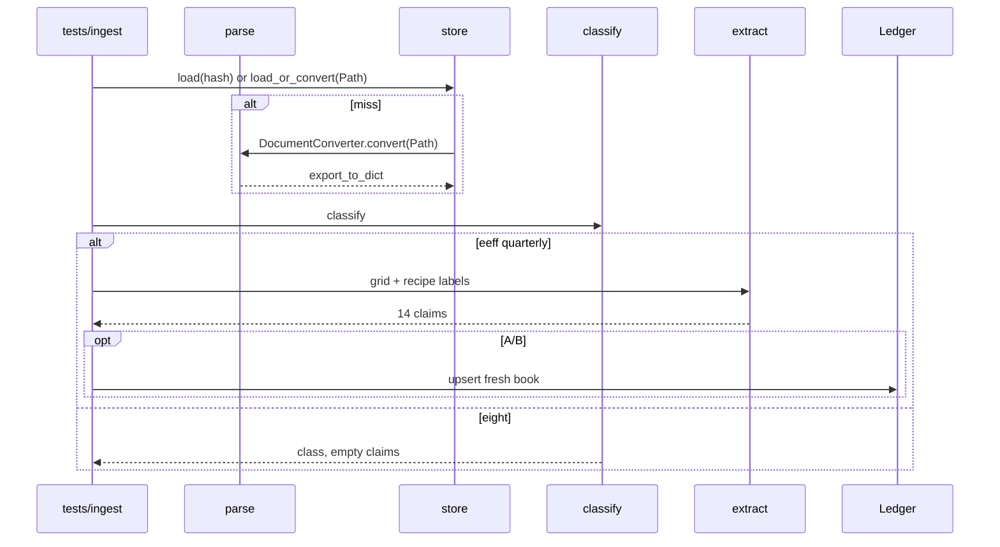

# Design: Fase 1 Docling Evidence Adapter

## Technical Approach

Locked approach 1. Rector §23 adapter is `src/claimledger/ingest/` (not a new layer). Local PDFs → hashed Docling JSON SoT → 14 recipe P&L rows from two quarterly EEFF; classify eight with zero identities. Kernel gold stays `Ledger.seed()`. Pin `docling==2.130.0`; never import `docling-graph`.

## Architecture Decisions

| Option | Tradeoff | Decision |
|--------|----------|----------|
| `src/claimledger/ingest/` + `tests/ingest/` | §23 adapter; AST-excludable | **Choose** |
| Sibling package / flat `adapter.py` | Unnamed package; breaks `*.py` scans | Reject |
| Hashed `export_to_dict` + `manifest.json` (`pdf_sha`→hash) | Load-from-hash; convert on miss | **Choose** |
| Markdown sidecar / live convert / extract all 10 | Flattened cells; flaky; gold leak | Reject |
| Classify eight, extract two EEFF | Corpus-complete; `recipe_no_extract` honest | **Choose** |
| `identity_key` + `signed_ars` + recipe labels | Kernel pattern; no LLM identity | **Choose** |
| LLM / VLM / MinerU / two parsers | Gate fail | Reject |
| Table-structure A/B as **test** (one winner) | Gold picks parser | **Choose** |
| Fresh-`Ledger` upsert A/B; seed untouched | Evidence check, not two books in gold | **Choose** |
| Switch `test_gold_*.py` to ingest | Docling in kernel demo | Reject |
| Explicit AST allowlist (7+6 files) | Survives `rglob` | **Choose** |

Gate: Docling only because the kernel cannot read a PDF. Graph, LlamaIndex, HTTP, UI, VLM, MinerU stay out.

## Data Flow

§23 Truth-plane. Stop at candidate + optional fresh upsert. Query unchanged.



Kernel gold: `Ledger.seed()` → `query(understand(q), book)`.

## File Changes

| File | Action | Description |
|------|--------|-------------|
| `src/claimledger/ingest/__init__.py` | Create | Public load/classify/extract; not re-exported by kernel |
| `src/claimledger/ingest/types.py` | Create | Frozen `StoredDocument`, `DocumentClass` |
| `src/claimledger/ingest/store.py` | Create | Canonical JSON hash; manifest; load-from-hash |
| `src/claimledger/ingest/parse.py` | Create | `Path` only; `do_ocr=False`; local `artifacts_path`; no URL/`HttpSource`/`docling-graph` |
| `src/claimledger/ingest/classify.py` | Create | Filename/pack → `eeff\|comunicado\|deck\|memoria\|transcript` |
| `src/claimledger/ingest/extract.py` | Create | `TableData.grid` + `ProvenanceItem`; furniture ignored; `normalize_period`; bbox 0–1 |
| `tests/ingest/test_store.py` | Create | Hash/load/miss-convert |
| `tests/ingest/test_classify.py` | Create | 10 files; eight emit 0 identities |
| `tests/ingest/test_extract.py` | Create | Two EEFF only |
| `tests/ingest/test_gold_compare.py` | Create | 14 rows vs `RECIPE_ROWS`; optional fresh Ledger A/B |
| `tests/test_{identity,gold_v1,gold_v2}.py` | Modify | AST allowlist: 7 kernel modules + 6 named `tests/test_*.py` |
| `openspec/specs/gold-regression/spec.md` | Modify | Docling-free = kernel scan, not ingest |
| `artifacts/docling/.gitkeep` | Create | Store root |
| `.gitignore` | Modify | Ignore `artifacts/docling/*.json` |
| `src/claimledger/{evidence,ledger,identity,lookup,query}.py` | None | No identity/lookup/query deltas |
| `pyproject.toml` | None | Pin already `docling==2.130.0` |

`src/claimledger/__init__.py` stays empty.

## Interfaces / Contracts

```python
@dataclass(frozen=True)
class StoredDocument:
    artifact_hash: str   # sha256(canonical JSON)
    json_path: Path      # artifacts/docling/<hash>.json
    source_pdf: Path

@dataclass(frozen=True)
class DocumentClass:
    kind: Literal["eeff", "comunicado", "deck", "memoria", "transcript"]
    issuer: str          # "BYMA"
    period: str | None   # quarterly EEFF only
```

`load(hash) -> dict`. `load_or_convert(pdf: Path) -> StoredDocument`. `classify(pdf, stored) -> DocumentClass`. `extract_recipe(stored, cls) -> tuple[FinancialClaim, ...]`: empty unless `kind=="eeff"` and `period` in `{PERIOD_1T26, PERIOD_2T26}`. Claims: `identity_key` + `signed_ars`; evidence fills hash, page, locator (`RESULTADO NETO DEL PERÍODO` on that row), optional bbox. Comunicado `21262335` ≠ identity. Scope = recipe label/column table.

EEFF: `BYMA_-_EEFF_31-03-2026_VF.pdf`, `BYMA - EEFF 30-06-2026.pdf`. Other eight as in exploration.

## Testing Strategy

Strict TDD. Ingest RED first; kernel stays green.

| Layer | What | Approach |
|-------|------|----------|
| Unit | store; classify 10; empty extract on eight | `tests/ingest/`; may import `docling` |
| Integration | 14 rows = `RECIPE_ROWS` (value, neighbor, tax, page/locator) | `test_gold_compare.py`; fix mapping, never gold |
| Isolation | AST + `docling not in sys.modules` | allowlist 7+6 |
| Kernel gold | v1 45 / v2 26 | `Ledger.seed()` |
| E2E | N/A | no HTTP/UI |

**400-line slices** (High if one PR): (1) AST narrow (2) parse/store (3) classify (4) extract (5) gold compare + A/B.

## Threat Matrix

N/A — no routing, shell, subprocess, VCS/PR, or process-integration boundary. Convert is a local library call on `Path`. `HttpSource`/URL forbidden. Model download is Docling first-run (hashed load + local `artifacts_path`), not a product API.

## Migration / Rollout

None. Rollback: delete `src/claimledger/ingest/`, `tests/ingest/`, `artifacts/docling/`; revert AST allowlist and `.gitignore`; leave seed, gold, `recipe_no_extract`, pin.

## Open Questions

None that block. Non-blocking: JSON artifacts stay generated (gitignore), not a second SoT.
