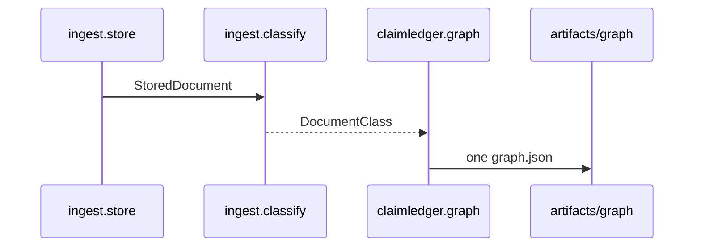

# Design: Fase 2 Graph Ingest

Follows the proposal and exploration (approach 1, §15, §20, §24). `Ledger.upsert` folds claim values, not documents of one period. The sibling package covers that gap.

## Technical Approach

`src/claimledger/graph/` builds the book at ingest and writes `artifacts/graph/graph.json` once. `claimledger.query` is unchanged and does not rebuild. Entities: Document, Issuer, Period, Statement. `FinancialClaim` stays in `Ledger`. The builder does not call `extract_recipe`.

`classify.period` stays `None` except quarterly EEFF. Period is an edge. IDs: issuer `BYMA` (ledger seed and `classify`; `identity.py` has no issuer constant and is not edited), `normalize_period` → `PERIOD_1T26` (`2026-03-31`) or `PERIOD_2T26` (`2026-06-30`), statement `income_statement`, document `artifact_hash`.

Inside the builder, check pin `docling-graph==1.9.1` (as `parse.convert_pdf` does) and import lazily. Use `graph_id_fields`, `NodeIDRegistry`, `GraphConverter` (`alias_llm_fn=None`), `GraphMerger` (`MergePolicy(conflicts="keep-all", export_format=None)`), and local `JSONExporter`. Provenance is a document-origin record (`document_id=artifact_hash`, local path). No `run_pipeline`, LLM/VLM, `ProvenanceBinder`, or Cypher/Neo4j. Tests forbid those call sites. Kernel and ingest never import `docling_graph`.

## Architecture Decisions

| Option | Tradeoff | Decision |
|--------|----------|----------|
| Sibling `graph/` + `tests/graph/` | Extra package; one permission sentence | Chosen |
| Code under `ingest/` | Breaks the forbid-scan and ingest MUST NOT | Rejected |
| Kernel module, `run_pipeline`, dict, or Neo4j | Breaks the kernel scan, zero-LLM, the pin, or Fase 11 | Rejected |
| `conflicts="keep-all"` → node `__conflicts__` | Visible clash; not `ledger_status` | Chosen |
| `ledger_status` or silent `keep-first` | Hides or overwrites the clash | Rejected |
| EEFF uses `DocumentClass.period`; else a known filename token | `classify` stays frozen; unknown token is doubt | Chosen |
| Write `DocumentClass.period`, or map memoria to a quarter | Breaks the `None` freeze, or invents a quarter | Rejected |
| Snapshot around the seven kernel imports | Full pytest may already have loaded the library | Chosen |
| Process-global ban, or a wider allowlist | Order-sensitive failure, or the library enters the kernel scan | Rejected |

## Data Flow

Same-period EEFF, comunicado, and deck share one Issuer, one Period, and one Statement. A transcript may edge to `2026-06-30` with no claim and no Statement. Memoria is Document plus Issuer; an unresolved year-end token is `doubt` and has no quarterly Period.

## File Changes

| File | Action | Description |
|------|--------|-------------|
| `src/claimledger/graph/__init__.py` | Create | Export `build` and `load`. No top-level `docling_graph`. |
| `src/claimledger/graph/schema.py` | Create | Four entities. Identity fields only. |
| `src/claimledger/graph/link.py` | Create | Period edge or `doubt` via `normalize_period`. |
| `src/claimledger/graph/build.py` | Create | Lazy pin, convert, merge, provenance, one JSON write. |
| `tests/graph/test_fold.py` | Create | Three shared IDs. No claim. No `extract_recipe`. |
| `tests/graph/test_period.py` | Create | Transcript links `2026-06-30`. Memoria off both quarters. Unknown token is doubt. |
| `tests/graph/test_conflict.py` | Create | `__conflicts__` on the node. No `ledger_status`. |
| `tests/graph/test_store.py` | Create | One file. `load` does not convert. Forbid `run_pipeline`, LLM, VLM, Neo4j. |
| `tests/test_identity.py` | Modify | Before/after snapshot of the seven imports. Allowlist stays 13 paths. |
| `.gitignore` | Modify | Ignore `artifacts/graph/*.json`. |
| `openspec/changes/fase-2-graph-ingest/specs/gold-regression/spec.md` | Modify | `graph/` MAY import the pin. Kernel and ingest stay forbidden. Gold numbers unchanged. |

Unchanged: ingest, kernel modules, the pin, and the ingest forbid-scan. No deletes.

## Interfaces / Contracts

Pydantic `graph_id_fields`: Document `artifact_hash` plus `kind` and optional `doubt`; Issuer `issuer="BYMA"`; Period `period` in `{PERIOD_1T26, PERIOD_2T26}`; Statement `statement="income_statement"`. Edges: `ISSUED_BY`, `FOR_PERIOD`, `OF_STATEMENT`. `build(records) -> Path` writes once. `load()` reads and does not convert. Conflict is `__conflicts__`. `doubt` is a Document field. Neither is `ledger_status`.

`normalize_period` matches a whole token, so the linker must not pass the raw filename. EEFF uses `DocumentClass.period`. Other kinds try separator-split tokens. `ValueError` records doubt and mints no period id.

## Testing Strategy

| Layer | What to Test | Approach |
|-------|-------------|----------|
| Unit | Fold, edge, doubt, `__conflicts__`, lazy pin | `tests/graph/`, in-memory. No PDF, network, or `extract_recipe`. |
| Integration | Seven-import snapshot; ingest still forbids `docling-graph` | Existing scans. Neither grows. Graph tests may import the library. |

Strict TDD. Kernel tests must not import `docling_graph`. `query` is not an end-to-end surface here.

## Threat Matrix

N/A — no routing, shell, subprocess, VCS/PR automation, executable-file classification, or process-integration boundary. Graph calls are local writes under `artifacts/graph/`.

## Migration / Rollout

No migration. Rollback deletes `graph/`, `tests/graph/`, and `artifacts/graph/`, restores the old `sys.modules` check and the gold-regression sentence, and leaves `Ledger.seed()`.

Slices: (1) package, forbid tests, import snapshot, gitignore; (2) period fold, transcript link, memoria doubt; (3) conflict attribute and single-file load. `Decision needed before apply: Yes`. `Chained PRs recommended: Yes`. `400-line budget risk: Medium`.

## Open Questions

None.
