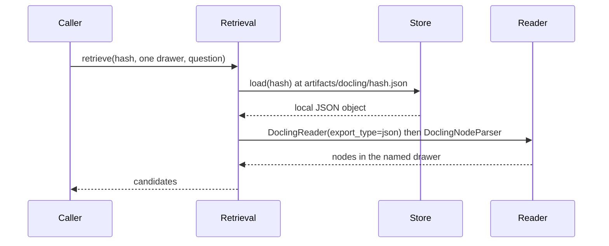

# Design: Fase 3 Retrieval

## Technical Approach

Sibling `src/claimledger/retrieval/` indexes hashed Docling JSON and returns candidates. `store.load` addresses `artifacts/docling/<sha256>.json` (`ingest/store.py`: `artifacts_dir() / f"{artifact_hash}.json"`, object required). The reader is `DoclingReader(export_type="json")` on that local path, then `DoclingNodeParser`. A call names one drawer: `tables` or `narrative`. `query.py` stays the ledger judge and is not called.

## Architecture Decisions

| Option | Tradeoff | Decision |
|--------|----------|----------|
| Sibling `retrieval/` + `tests/retrieval/` | Third package; off the 13-path scan | **Choose.** Same boundary as `graph/` |
| Index inside `ingest/` | Breaks the six-file inventory and the LlamaIndex ban | Reject |
| Search in `query.py`, one mixed index, or an agent | Kernel import, neighbor-row mix, or a skipped kernel | Reject |
| `DoclingReader(export_type="json")` | Must override the markdown default | **Choose.** Markdown is not source of truth |
| One drawer per call | Caller cannot ask both at once | **Choose.** Mixing drawers fails |
| Candidates only | No `verified` / `abstained`, no `FinancialClaim` write | **Choose.** Kernel still judges |
| Lazy import inside retrieval functions | Import cost on first use | **Choose.** Same as `graph/build.py` `_convert_and_merge` |
| Leave `FORBIDDEN_IMPORT_ROOTS` as `docling`, `docling_graph` | Seal is placement, not a new root | **Choose.** Do not widen the 13 paths or the import snapshot |

`src/claimledger/__init__.py` stays empty. Ingest does not import `llama_index`. Retrieval does not import `docling_graph`, does not call `load_or_convert` or `convert_pdf`, and does not fetch a URL.

## Data Flow



No `query()`, no ledger write, no graph rebuild.

```python
def _nodes_from_hashed_json(path: Path):
    # Import DoclingReader and DoclingNodeParser inside the function.
    reader = DoclingReader(export_type="json")
```

The module path follows the pin chosen at apply.

## File Changes

| File | Action | Description |
|------|--------|-------------|
| `src/claimledger/retrieval/__init__.py` | Create | Package marker. No `llama_index` import |
| `src/claimledger/retrieval/read.py` | Create | Local hashed JSON path; lazy JSON reader and node parser |
| `src/claimledger/retrieval/drawers.py` | Create | `tables` and `narrative`; one named drawer; candidates |
| `tests/retrieval/test_read.py` | Create | RED: `export_type="json"`, local path, no PDF, no URL |
| `tests/retrieval/test_drawers.py` | Create | RED: one drawer, mix fails, neighbor rows as candidates, not `verified` |
| `tests/test_identity.py` | Modify | Retrieval init stays off the allowlist; `len == 13`. No `llama_index` import |
| `openspec/specs/gold-regression/spec.md` | Modify | Delta: retrieval is off the scan; kernel and ingest stay free of `llama_index` |
| `pyproject.toml` | Modify at apply | Record the pin selected then |
| `src/claimledger/__init__.py`, `query.py`, `ingest/` | Unchanged | Empty kernel init; no wiring; no `llama_index` in ingest |

## Interfaces / Contracts

```python
DrawerName = Literal["tables", "narrative"]

@dataclass(frozen=True)
class Candidate:
    drawer: DrawerName
    text: str
    ref: str  # node ref in the artifact, not an identity key

def retrieve(artifact_hash: str, drawer: DrawerName, question: str) -> tuple[Candidate, ...]
```

`tables` holds number rows, including both neighbor rows when present. `narrative` is explain-later and is not merged into `tables`. An unknown drawer, or a call that names both, raises. `Candidate` has no `verified` or `abstained` status and is not a `FinancialClaim`.

## Testing Strategy

| Layer | What to Test | Approach |
|-------|-------------|----------|
| Unit | JSON override, one drawer, mix fails, result is not a `QueryResult` | Strict TDD in `tests/retrieval/`. Fixture JSON. No network, no PDF |
| Kernel seal | 13 paths; snapshot of `docling` / `docling_graph` | `tests/test_identity.py` stays green. Retrieval tests are not on the allowlist |
| Ingest seal | Six ingest modules; no `llama_index` | Do not add an ingest file |
| E2E | N/A | Fase 4 wires `query` |

## Threat Matrix

N/A — no routing, shell, subprocess, VCS/PR automation, executable-file classification, or process-integration boundary. A reader on a local JSON path is not a new HTTP API.

## Migration / Rollout

No migration. Rollback deletes `src/claimledger/retrieval/` and `tests/retrieval/`, reverts the gold-regression delta and the allowlist assertion, and drops any LlamaIndex pin added at apply. Hashed JSON, kernel, ingest, graph, and `query` stay.

**400-line slices** (authored lines). Slice 1: package, JSON reader, allowlist assertion, gold-regression sentence. Slice 2: drawers and the candidate contract. Each slice stays under 400 lines.

Decision needed before apply: Yes
Chained PRs recommended: Yes
400-line budget risk: Medium

## Open Questions

None that block.

**Design note:** `pyproject.toml` has no LlamaIndex pin (`dependencies = []`; extra `docling` is only `docling==2.130.0` and `docling-graph==1.9.1`). `docs/stack-oportunidades.md` records a tentative note `llama-index-readers-docling==0.5.0` (“validar contra Docling 2.130 en Fase 3”). That sentence is a note, not a project pin. Apply selects a release compatible with `docling==2.130.0` and records it in `pyproject.toml` then.
