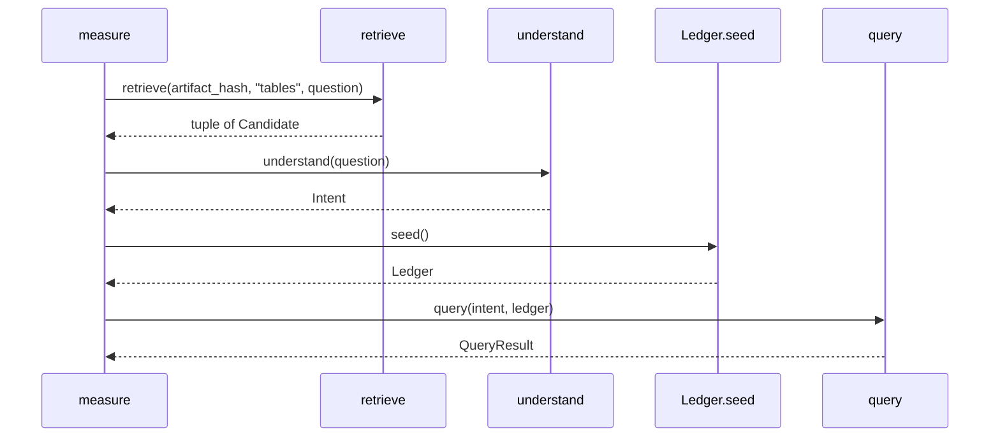

# Design: Fase 4 Verify Eval

## Technical Approach

Approach 1. `query` (`src/claimledger/query.py`) and `retrieve` (`src/claimledger/retrieval/drawers.py`) stay as they are: the first judges an `Intent` against `Ledger`, the second returns one drawer of `Candidate` rows. Specs: `verify-eval` and `gold-regression`.

The single new symbol is `measure` in `src/claimledger/eval/measure.py`. `measure(artifact_hash, question)` runs only this order:

1. `retrieve(artifact_hash, "tables", question)` — `question` is passed through; it does not drop a row.
2. `understand(question)` — scope and metric come from the question, never from candidate text.
3. `query(intent, Ledger.seed())`.

It returns `(candidates, result)`: the `Candidate` tuple and the `QueryResult`. It does not upsert, does not set `verified` on a `Candidate`, and does not import `llama_index`. `retrieve` still does not call `query`. `src/claimledger/__init__.py` stays empty. `eval` stays out of `KERNEL_MODULES` and the 13-path tuple. `query.py`, `lookup.py`, and `ledger.py` do not import retrieval.

## Architecture Decisions

| Option | Tradeoff | Decision |
|---|---|---|
| `measure` in `eval/measure.py` returns `(tuple[Candidate, ...], QueryResult)` | The join sits outside the seven kernel modules; tasks point at one symbol | **Choose** |
| `candidates` argument on `query` | Couples a scanned kernel module to retrieval and still selects by identity | Reject |
| Choice, `verified`, or upsert inside `retrieve` | Breaks the drawer seal; both fixture rows share `#/tables/1` | Reject |
| Ranker, Recall@k, MRR, or a new library | `retrieve` already returns every tables node and has no score | Reject |
| Point gold v1/v2 at Docling JSON | Loads `llama_index` into the scanned harness and moves gold off `Ledger.seed()` | Reject |

`eval/__init__.py` is a docstring-only package marker, like `retrieval/__init__.py`. `llama_index` stays inside `read._nodes_from_hashed_json`, which these tests never call.

## Data Flow



`Candidate` stays `drawer`, `text`, `ref`. Both neighbors may share `#/tables/1`. The verified number is `result.claims[].value` (`21262335` consolidated, `21259769` parent). Narrative text is not a candidate here. `Ledger.seed()` still writes its fourteen recorded rows with empty `evidence`. `measure` adds no write.

## File Changes

| File | Action | Description |
|------|--------|-------------|
| `src/claimledger/eval/__init__.py` | Create | Package marker. No re-export |
| `src/claimledger/eval/measure.py` | Create | `measure` |
| `tests/eval/test_measure.py` | Create | Stubbed reader. Two TDD slices |
| `src/claimledger/__init__.py` | None | Stays empty |
| `src/claimledger/query.py` | None | No retrieval import. No `candidates` argument |
| `src/claimledger/lookup.py` | None | `understand` stays question-only |
| `src/claimledger/ledger.py` | None | `Ledger.seed()` unchanged |
| `src/claimledger/retrieval/drawers.py` | None | `retrieve` still does not call `query` |
| `src/claimledger/retrieval/read.py` | None | Tests stub `read_hashed_json` |
| `tests/test_identity.py` | None | `KERNEL_MODULES` and the 13 paths stay |
| `tests/test_gold_v1.py` | None | Stays `query(understand, Ledger.seed())` |
| `tests/test_gold_v2.py` | None | Same harness, including `-14950948` |
| `tests/retrieval/test_drawers.py` | None | Drawer seal stays |

## Interfaces / Contracts

```python
def measure(
    artifact_hash: str, question: str
) -> tuple[tuple[Candidate, ...], QueryResult]:
    candidates = retrieve(artifact_hash, "tables", question)
    intent = understand(question)
    result = query(intent, Ledger.seed())
    return candidates, result
```

The drawer is the literal `"tables"`. There is no ledger argument, rank score, or HTTP body.

## Testing Strategy

Strict TDD. Two slices in `tests/eval/test_measure.py`. Follow `tests/retrieval/test_drawers.py`: local JSON under `tmp_path`, then `monkeypatch` `read_hashed_json` to return `SimpleNamespace` nodes (`text`, `metadata.doc_items`). No PDF, network, Docker, or live `llama_index`.

| Layer | What to Test | Approach |
|-------|-------------|----------|
| Unit slice 1 | Call order; both neighbor texts; consolidated `21262335`; parent `21259769`; shared `#/tables/1`; `ledger_status` `recorded`; empty question keeps both rows | RED while `measure` is missing, then the function above |
| Unit slice 2 | `recipe_no_extract` on memoria, comunicado, deck, and contrato abstains beside a candidate that contains `21262335`; compare returns `21262335` and `81956525` with no difference; one `retrieve(..., "tables", ...)` call; narrative text is absent from candidates | Same stub, with the narrative node in the fixture |
| Integration | — | Out of this change |
| E2E | — | Out of this change |

Slice 1 spies the order `retrieve`, `understand`, `query`. `Ledger.upsert` runs only for the fourteen seed rows. Returned claims stay `recorded`. The other neighbor number is absent from `result.claims`.

Slice 2 reads `tests/test_identity.py` and asserts `claimledger.eval` is absent from `KERNEL_MODULES` and from the 13-path tuple. It reads both gold files and asserts they still call `Ledger.seed()` and do not call `retrieve`. Those files are not edited.

## Threat Matrix

N/A — no routing, shell, subprocess, VCS/PR automation, executable-file classification, or process-integration boundary.

## Migration / Rollout

No migration. Rollback deletes `src/claimledger/eval/` and `tests/eval/`. Kernel modules, `Ledger.seed()`, and the gold files stay.

## Open Questions

None.
