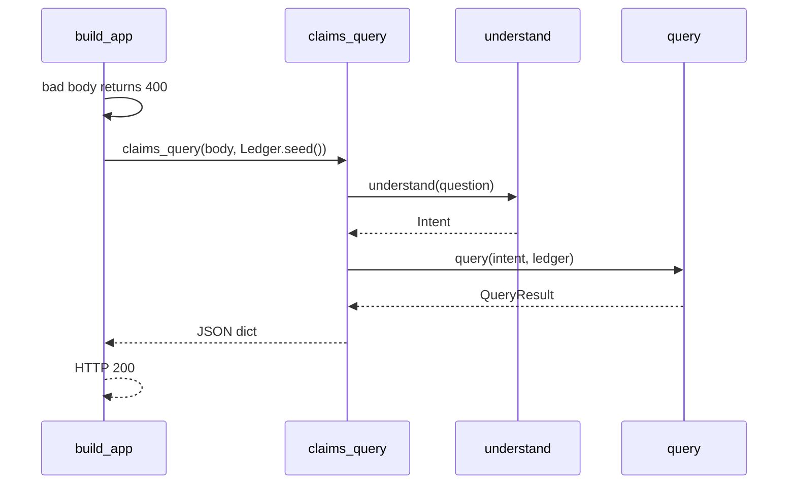

# Design: Fase 6 HTTP Query

## Technical Approach

Approach 1. Specs: `http-query`, `gold-regression`. `understand` and `query` stay the identity step and the judge. The HTTP mouth is a sibling package outside the seven kernel modules. `query.py` does not import `claimledger.http`. `src/claimledger/__init__.py` stays empty.

Two symbols:

- `claims_query(body, ledger)` in `src/claimledger/http/claims.py`. Pure. Parsed body plus a `Ledger`. Calls `understand(question)` then `query(intent, ledger)`. Returns a JSON-ready `dict`. Does not import `starlette`.
- `build_app()` in `src/claimledger/http/app.py`. Starlette app with only `POST /claims/query`. Calls `claims_query` with `Ledger.seed()`. HTTP 200 for verified or abstained. HTTP 400 skips `understand` and `claims_query`.

`starlette` is imported inside `build_app` only. `http/__init__.py` is a docstring-only marker, like `eval/__init__.py`. Pin `starlette==1.0.0` in optional extra `http`. `dependencies` stays `[]`. No FastAPI, Flask, or uvicorn pin.

## Architecture Decisions

| Option | Tradeoff | Decision |
|---|---|---|
| `claims_query` + `build_app`, extra `http` | Kernel import stays free of Starlette; the route exists | **Choose** |
| Pin in `dependencies` | Bare install pulls a framework kernel tests must not import | Reject |
| Top-level `import starlette` | Package import loads Starlette before `build_app` | Reject |
| Function only, no app | Phase 6 closes on `POST /claims/query` | Reject |
| FastAPI, Flask, uvicorn, or `measure` | Extra pins, OpenAPI, or a hash the body lacks | Reject |
| Singular `claim` for compare | Drops `21262335` or `81956525` | Reject |
| Rewrite to `no_verified_claim` | Hides the six kernel reasons | Reject |

## Data Flow



`measure`, `retrieve`, and `upsert` stay off this path. JSON `status` is `QueryResult.status`, never `ledger_status`.

One verified claim: `status`, `claim` (`issuer`, `period`, `statement`, `scope`, `metric`, `value`, `currency`), `evidence`. `value` stays the kernel digit string. Seed `evidence` is `[]`. A non-empty tuple emits only `document_id`, `page`, and `text`. Absent: `answer`, `identity`, `identity_key`, `unit`, `ledger_status`, `artifact_hash`, `label`, `bbox`.

Abstained: `{"status": "abstained", "reason": "<kernel reason>"}` with no claim and no value. Pass through `off_corpus`, `recipe_no_extract`, `unresolved_identity`, `no_matching_claim`, `incomplete_comparison`, `ambiguous_period`.

Compare: `status` `verified`, `claims` length 2 in book order (`21262335`, then `81956525`). Each item is the rector claim fields plus `evidence: []`. No singular `claim`, no `delta`, no subtracted number. HTTP 400 is `{}` with no `status` key.

## File Changes

| File | Action | Description |
|------|--------|-------------|
| `src/claimledger/http/__init__.py` | Create | Docstring only. No re-export |
| `src/claimledger/http/claims.py` | Create | `claims_query` |
| `src/claimledger/http/app.py` | Create | `build_app`, lazy Starlette import |
| `tests/http/test_claims_query.py` | Create | Contract on `Ledger.seed()`. No port |
| `tests/http/test_app.py` | Create | In-process app. No port |
| `pyproject.toml` | Modify | Extra `http = ["starlette==1.0.0"]` |
| `src/claimledger/__init__.py` | None | Stays empty |
| `src/claimledger/query.py` | None | Does not import `http` |
| `src/claimledger/lookup.py` | None | `understand` stays question-only |
| `tests/test_identity.py` | None | 13-path tuple unchanged |

## Interfaces / Contracts

```python
def claims_query(body: dict[str, object], ledger: Ledger) -> dict[str, object]:
    intent = understand(body["question"])  # question is str
    return _json(query(intent, ledger))

def build_app() -> Starlette:
    # from starlette... inside this function only
    ...
```

`build_app` parses JSON. Invalid JSON, a non-object, a missing `question`, or a non-string `question` returns 400 and does not call `claims_query`.

## Testing Strategy

Strict TDD. Two slices. No socket, Docker, network, or uvicorn.

| Layer | What to Test | Approach |
|-------|-------------|----------|
| Unit slice 1 | `claims_query` on `Ledger.seed()`: `21262335`, parent `21259769`, tax `-14950948`, `evidence` `[]`, six reasons, compare length 2, no delta; no `starlette` in `claims.py`; `http` off the 13 paths | RED while `claims_query` is missing |
| Unit slice 2 | Only `POST /claims/query`; 200 verified and abstained; 400 and `understand` not called; `starlette` import only inside `build_app` | `TestClient` if that import works, else `httpx` `ASGITransport`. No port. Do not pin the client |
| Integration | — | Out of this change |
| E2E | — | Out of this change |

## Threat Matrix

| Boundary | Applicability | Design response | Planned RED tests |
|---|---|---|---|
| Documentation-like paths | N/A: no executable-file classification | — | None |
| Git repository selection | N/A: no git selector | — | None |
| Commit state | N/A: no commit | — | None |
| Push state | N/A: no push | — | None |
| PR commands | N/A: no PR automation | — | None |

## Migration / Rollout

No migration. Rollback deletes `src/claimledger/http/`, `tests/http/`, and the `http` extra. Kernel `query` and `Ledger.seed()` stay.

## Open Questions

None.
