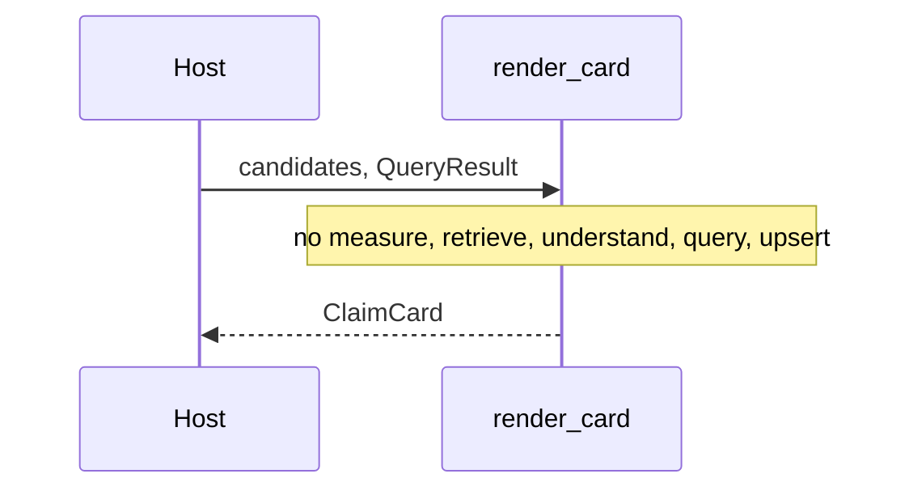

# Design: Fase 7 Claim Card

## Technical Approach

Approach 1. `render_card(candidates, result)` in `src/claimledger/card/card.py` turns the pair `measure` already returns into a frozen `ClaimCard`. It reads `QueryResult.status`, `reason`, and `claims`, plus `Candidate.text`. It does not call `measure`, `retrieve`, `understand`, `query`, or `upsert`. Specs: `claim-card` and `gold-regression` (the card stays off the 13-path scan). `src/claimledger/__init__.py` stays empty. `dependencies` stays `[]`.

## Architecture Decisions

| Option | Tradeoff | Decision |
|---|---|---|
| Dict vs frozen dataclass | A dict matches "display dict"; a dataclass matches `QueryResult` and `Candidate` | Frozen `ClaimCard` |
| Phase-6 JSON or a new route | That JSON has no candidates; a second route breaks http-query | Input is `(candidates, QueryResult)` only |
| Seal from `ledger_status` | Seed rows stay `recorded` while the verdict is `verified` | `verified` → `VERIFICADO`; `abstained` → `ME ABSTENGO` |
| Parse row digits or compare the two neighbor numbers | That re-decides the neighbor | `values` copies `claim.value` in order; rows copy `Candidate.text` in order |
| Guess the parent chip from row text | The spec forbids chip `Consolidado` and leaves the Spanish parent label open | Closed map. Stored scope `parent_attributable` (`lookup.SCOPE_PARENT`) → `Controlante` |
| Two-row copy on abstain or compare | Abstain must not claim a verified row; compare must not subtract | Sentence only for one verified claim that has both rows |

`Controlante` is the Spanish name already bound to token `parent_attributable`: `evals/aliases.json` uses `controlante|resultado_atribuible_controladora`, and the rector names that scope controlante. The chip is not `Consolidado`, not the English token, and not text parsed from the row.

## Data Flow

```
caller (pytest now; a later host)
  candidates, QueryResult
        |
        v
  render_card  -- status, reason, claims, Candidate.text
        |         closed maps only; no kernel call
        v
  ClaimCard
```



## File Changes

| File | Action | Description |
|------|--------|-------------|
| `src/claimledger/card/__init__.py` | Create | Docstring only. No re-export. |
| `src/claimledger/card/card.py` | Create | `ClaimCard`, closed maps, `render_card` |
| `tests/card/test_render_card.py` | Create | Builds `QueryResult` and `Candidate` in memory |

No edits to `measure`, `http`, kernel modules, `tests/test_identity.py`, gold, or `pyproject.toml`.

## Interfaces / Contracts

`ClaimCard`: `seal: str`, `chips: tuple[str, ...]`, `rows: tuple[str, ...]`, `values: tuple[str, ...]`, `sentence: str`, `reason: str | None`. One verified claim is a one-tuple in `values` (the value). Compare is two strings. Abstain uses `values == ()` and copies `result.reason`.

One chip string per verified claim: `{issuer} · {period} · {scope} · {metric}`. Issuer is the stored string (`BYMA`).

| Stored token | Chip |
|---|---|
| `2026-03-31` (`PERIOD_1T26`) | `1T26` |
| `2026-06-30` (`PERIOD_2T26`) | `2T26` |
| `consolidated` (`SCOPE_CONSOLIDATED`) | `Consolidado` |
| `parent_attributable` (`SCOPE_PARENT`) | `Controlante` |
| `net_income` (`METRIC_NET_INCOME`) | `Resultado neto` |

Map keys are those stored strings. `card.py` may import the constants and must not call `understand`. An unknown token on a verified claim raises `ValueError`. Abstain does not read claim fields, so a row that contains `21262335` is not a value.

Sentences, only when `status == "verified"`, one claim, and two rows:

- `consolidated`: `encontré estas dos filas; verifiqué la consolidada`
- `parent_attributable`: `encontré estas dos filas; verifiqué la controlante`

Otherwise `sentence` is `""`. Compare shows `21262335` and `81956525`, has no delta field, and does not subtract. `card.py` must not import `starlette`, `docling`, `llama_index`, or `open_webui`. Tests import `claimledger.card.card`.

## Testing Strategy

Strict TDD. Two slices, one module. No PDF, network, Docker, or live reader. Build `FinancialClaim` with `evidence=()` and `ledger_status="recorded"`, as seed stores rows. The seal still follows `QueryResult.status`.

| Layer | What to Test | Approach |
|---|---|---|
| Unit slice 1 | Consolidated and parent cards | RED first: seal, chips, both row texts in order, `values`, sentence |
| Unit slice 2 | Abstain, empty candidates, compare, recorded seal, imports | RED: `ME ABSTENGO` and `recipe_no_extract`; empty rows still abstain; both compare values and no delta; recorded on an abstain is not `VERIFICADO`; source has no forbidden imports |
| Integration | None | `render_card` does not call `measure` |
| E2E | None | Open WebUI is out of scope |

Do not add `src/claimledger/card/` or `tests/card/` to `_kernel_scan_paths`.

## Threat Matrix

N/A — no routing, shell, subprocess, VCS/PR automation, executable-file classification, or process-integration boundary.

## Migration / Rollout

No migration. Rollback: delete `src/claimledger/card/` and `tests/card/`. Kernel, `measure`, and `POST /claims/query` stay.

## Open Questions

None. The parent chip `Controlante` is frozen from scope token `parent_attributable`.
