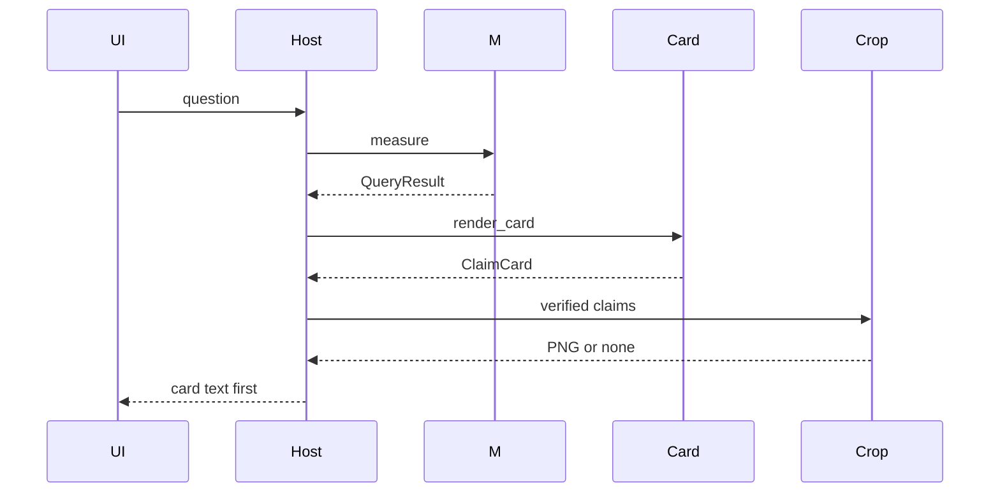

# Design: Phase 8 Page Crop

## Technical Approach

`specs/page-crop`, `specs/docling-ingest`, `specs/openwebui-host`. Architecture Gate: stored `FinancialEvidence.bbox` and `render_card` are not a picture. `src/claimledger/crop/` cuts a caller raster and places that PNG after `card_text`, off `_kernel_scan_paths` and off `src/claimledger/http/`. `measure` then `render_card` stay first. The kernel still chooses `21262335` and `21259769`.

## Architecture Decisions

| Decision | Choice | Rejected | Why |
|---|---|---|---|
| Module | `crop/cut.py`, `crop/attach.py` | Logic in `http/`; a kernel file; a viewer | Coordinates are not pixels. The only product route stays `POST /claims/query` |
| Rectangle | Stored `FinancialEvidence.bbox` | A second table-`prov` box; padding; an origin field | `_cell_bbox` else `_provenance_bbox` already filled that tuple |
| Y window | Half-open: row `floor((1-y1)*H)` .. `ceil((1-y0)*H)`; col `floor(x0*W)` .. `ceil(x1*W)`; clamp | `y0` as the top row | `_normalize_bbox` sets `y0 = min(b, t) / height` and ignores `coord_origin` |
| Raster | Row-major RGB `bytes`, length `width*height*3` | Pillow in `cut.py`; another PDF library | `dependencies` stay `[]`. Pillow 11.1.0 is already in the docling extra |
| Sidecar | `artifacts/docling/<artifact_hash>.p<page_no>.png` | Pixels in `canonical_json_bytes`; re-raster at question time | The hash is the stripped JSON. `FinancialEvidence.page` is that `page_no` |
| Export | `generate_page_images = True`; `images_scale` stays `1.0`; `strip_page_pixels` before the hash | Pin default `False`; embedding `ImageRef.uri` | Pin `2.130.0`: `export_to_dict` is `model_dump` and can keep a `data:` URI |
| Match | `extract_recipe` on the hashed JSON; same `identity_key` and `value` | Seed evidence; `Candidate`; query JSON | `Ledger.seed()` uses `evidence=()`. `measure` does not crop |
| Completion | `reply` appends `` after `card_text` | A new route; an image on `render_card`; a second message | `build_host` already sends that one string, including SSE |
| Miss | Abstain, other value, zero area, or no file → card only | Open the PDF | The manifest has no PDF path |

## Data Flow



`card_text` stays first. Pictures follow `result.claims` order, with no delta. Bbox `0.2, 0.5, 0.4, 0.6` on a 10×10 raster is rows `[4, 5)` and columns `[2, 4)`.

`load_or_convert` hashes `strip_page_pixels(export_to_dict())`, writes `<hash>.json`, then one PNG per `document.pages` key from `page.image.pil_image`. The strip drops `pages[*].image` and any `data:image` URI. A missing sidecar leaves that JSON.

## File Changes

| File | Action | Description |
|---|---|---|
| `src/claimledger/crop/__init__.py` | Create | Empty marker |
| `src/claimledger/crop/cut.py` | Create | `crop_bbox` on raw RGB bytes |
| `src/claimledger/crop/attach.py` | Create | Match, sidecar, markdown PNG |
| `src/claimledger/ingest/parse.py` | Modify | Page images on; PNG bytes to the store |
| `src/claimledger/ingest/store.py` | Modify | `strip_page_pixels`; write `<hash>.p<page_no>.png` after the hash |
| `src/claimledger/openwebui/reply.py` | Modify | `card_text`, then pictures |
| `tests/crop/test_crop.py` | Create | Synthetic pixels and match cases |
| `tests/ingest/test_store.py` | Modify | Hash ignores a synthetic blob and a sibling PNG |
| `tests/openwebui/test_host.py` | Modify | Picture after the card; allow package `crop`; phases 9–13 still wait |
| `.gitignore` | Modify | `artifacts/docling/*.png` |
| `evidence.py`, `extract.py`, `card/card.py`, `eval/measure.py`, `http/`, `openwebui/text.py`, `openwebui/app.py`, `pyproject.toml`, `tests/test_identity.py` | Unchanged | Bounds |

## Interfaces / Contracts

```python
def crop_bbox(pixels: bytes, width: int, height: int,
              bbox: tuple[float, float, float, float] | None) -> bytes | None: ...

def strip_page_pixels(payload: dict) -> dict: ...

def page_sidecar(artifact_hash: str, page_no: int) -> Path:
    return artifacts_dir() / f"{artifact_hash}.p{page_no}.png"

def reply(artifact_hash: str, question: str) -> str:
    candidates, result = measure(artifact_hash, question)
    text = card_text(render_card(candidates, result))
    images = attach(artifact_hash, result)
    return text if not images else text + "\n" + "\n".join(images)
```

`convert_pdf` still returns the stripped `dict`. `PINNED_DOCLING` stays `"2.130.0"`. `attach` calls `extract_recipe` on `artifacts/docling/<artifact_hash>.json` with `DocumentClass(kind="eeff", issuer=claim.issuer, period=claim.period)` and does not open `source_pdf`. Pillow is imported only inside `attach` and `parse.py`.

## Testing Strategy

| Layer | What to Test | Approach |
|---|---|---|
| Unit | Y window; no padding; no box; zero area; strip-then-hash; abstain; neighbor value | Synthetic RGB bytes and a JSON blob. No `docling`, PDF, network, or Docker |
| Integration | Card text first; one data URI on match; compare is two pictures and no delta; query and `render_card` stay plain; 13 paths | In-process host. Stub sidecar pixels |
| E2E | Out of scope | No container and no PDF |

## Threat Matrix

N/A — no routing, shell, subprocess, VCS/PR automation, executable-file classification, or process-integration boundary.

## Migration / Rollout

No migration. Rollback removes the crop package, sidecar writes, and the host append, and restores the crop wait. Hashes, card, query route, gold, and the 13 paths stay. Do not commit gitignored artifacts.

## Open Questions

None. Pin `2.130.0` defaults `generate_page_images` to false; this change sets it true and still strips before the hash.
