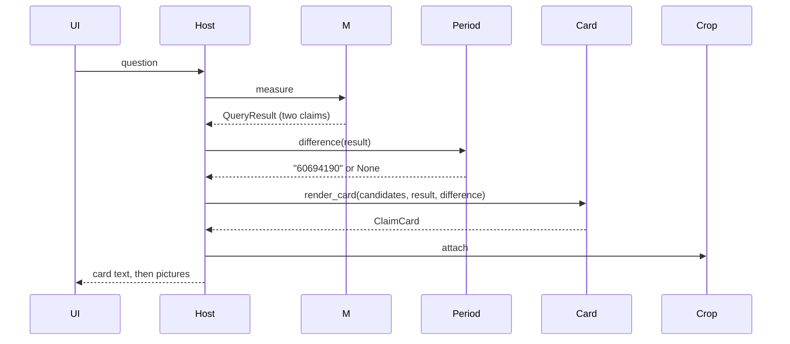

# Design: Phase 9 Period Pack and Compare Subtraction

## Technical Approach

`specs/query`, `specs/claim-card`, `specs/openwebui-host`, `specs/verify-eval`. Architecture Gate: the pack half stands — `fold_documents`, `GraphMerger(conflicts="keep-all")`, `Ledger.upsert`, `extract_recipe`. The gap is arithmetic: no pinned API subtracts two verified claims. Custom code is that subtraction only, in `src/claimledger/period/`, off `_kernel_scan_paths` and off `http/`. `query` and `measure` are unchanged; `reply` calls the function on the `QueryResult` it already has and hands the optional string to `render_card`.

## Architecture Decisions

| Decision | Choice | Rejected | Why |
|---|---|---|---|
| Module | `period/difference.py`; `difference(result: QueryResult) -> str \| None` | `QueryResult` field; code in `query`, `card`, `digits`, `http/` | Verifying and subtracting are two jobs. `tests/test_query.py` forbids `delta`/`difference` fields; the card must not parse digits; `digits.py` is frozen |
| Gate | `verified`, exactly two claims, equal `issuer`, `statement`, `scope`, `metric`, `currency`, `unit`; `period` differs; both `recorded`. Else `None` | Any pair; raising | Mismatch yields no number, never a wrong one. `currency`/`unit` already exist on the claim |
| Order | `sorted(claims, key=period)`; later minus earlier | Tuple order; datetime parsing | ISO dates sort as strings. Gives `60694190` and `-17780588` |
| Arithmetic | `str(int(later.value) - int(earlier.value))` | `Decimal`; a pin | `validate_claim` pins `^-?\d+$`, so `int` is exact. `str(int)` is the `signed_ars` shape: `-` kept, no `+`. Zero → `"0"` |
| Output | Plain `str`; no `identity_key`; never upserted; never read by gold | Third `FinancialClaim`; synthetic period; 15th row | No document prints `60694190`. Principles 19–20 |
| Card | `render_card(candidates, result, difference=None)`; `ClaimCard.difference: str = ""` holds the full labelled line | Field `delta`; label in `text.py`; widening `_METRIC_CHIP` | Card owns Spanish labels; `text.py` stays a copier. Default keeps existing calls |
| Line | `"Diferencia entre las dos cifras verificadas: 60694190"`, set only when verified, two claims, string present | "segundo trimestre"; "trimestre aislado"; "claims"; line on abstain or single | 2T26 may be cumulative; label it as the difference of two verified figures |
| Text order | seal, chips, rows, values, difference, sentence, reason | Difference last | `openwebui-host` order |
| Caller | `reply` only, crop after | `measure`; `render_card`; `app.py`; `POST /claims/query` | Host MAY; `measure` MUST NOT; `http-query` forbids `delta` |

## Data Flow



Canonical pair: `81956525` minus `21262335`. Signed scenario: `-32731536` minus `-14950948` = `-17780588`.

## File Changes

| File | Action | Description |
|---|---|---|
| `src/claimledger/period/__init__.py` | Create | Empty marker |
| `src/claimledger/period/difference.py` | Create | Gate; later minus earlier |
| `src/claimledger/card/card.py` | Modify | Third optional argument; `ClaimCard.difference`; `_DIFFERENCE_LABEL` |
| `src/claimledger/openwebui/text.py` | Modify | Append `card.difference` after values |
| `src/claimledger/openwebui/reply.py` | Modify | Call `difference`; pass to `render_card` |
| `tests/period/test_difference.py` | Create | Seed pairs, sign, mismatches, refusals, `period` not imported by kernel or `measure`, 14 rows, docling-free |
| `tests/card/test_render_card.py` | Modify | Line with string; no line without; abstain/single ignore a passed string |
| `tests/openwebui/test_host.py` | Modify | `_compare_card()` gains the line; `_picture_sources` adds `period/`; `test_wave_c_still_waits` → `period` present, `range(10, 14)`; allowlist excludes `period` |
| Kernel seven, `eval/measure.py`, `http/`, `graph/`, `ingest/`, `crop/`, `openwebui/app.py`, `pyproject.toml`, kernel tests, gold, `evals/` | Unchanged | Bounds; 13 paths; `cp-*` pairs |

## Interfaces / Contracts

```python
# src/claimledger/period/difference.py
def difference(result: QueryResult) -> str | None: ...

# src/claimledger/card/card.py
_DIFFERENCE_LABEL = "Diferencia entre las dos cifras verificadas"

@dataclass(frozen=True)
class ClaimCard:
    ...  # six existing fields
    difference: str = ""

def render_card(
    candidates: tuple[Candidate, ...],
    result: QueryResult,
    difference: str | None = None,
) -> ClaimCard: ...

# src/claimledger/openwebui/reply.py
def reply(artifact_hash: str, question: str) -> str:
    candidates, result = measure(artifact_hash, question)
    text = card_text(render_card(candidates, result, difference(result)))
    images = attach(artifact_hash, result)
    return text if not images else text + "\n" + "\n".join(images)
```

`difference.py` imports only `QueryResult`. `query.py` and `measure.py` never import `claimledger.period`.

## Testing Strategy

| Layer | What to Test | Approach |
|---|---|---|
| Unit | `60694190` via `query(understand(compare), Ledger.seed())`; `-17780588` from the seed `income_tax` pair; `None` for scope, metric, unit mismatch, same period, `conflicted`, abstained, one claim; `str` not `FinancialClaim`; 14 rows; AST: no `period` import in `query.py`/`measure.py`; no `docling` in `period/` | In memory. No `docling`, PDF, network, Docker |
| Integration | Card line; no line without string; abstain/single unchanged; host compare text first with `60694190`, then two pictures; 13 paths exclude `period` | In-process host |
| E2E | Out of scope | No container, no PDF |

`currency` mismatch is unreachable through a valid claim (`validate_claim` pins `ARS`); the guard stays, the test covers `unit`.

## Threat Matrix

N/A — no routing, shell, subprocess, VCS/PR automation, executable-file classification, or process-integration boundary.

## Migration / Rollout

No migration. Rollback deletes `period/` and its tests and reverts three display lines.

## Review Budget Forecast

Code ≈ 55 lines; tests ≈ 200; SDD artifacts ≈ 500 more on the branch. Risk: Medium. Two slices: **A** `period/` + `tests/period/` (kernel-free, green alone); **B** card, text, reply, their tests. `test_wave_c_still_waits` fails today because `fase-9-pack` is active; slice A moves its range to `10..13` first.

## Open Questions

None. The `query` purpose sentence "until Fase 9" is left for archive.
