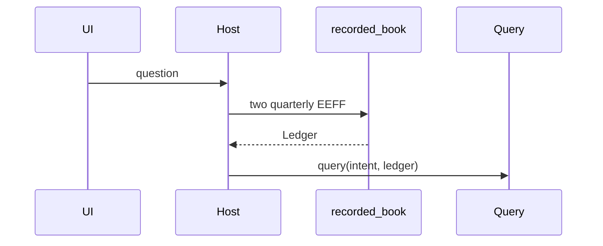

# Design: Ground the product ledger

## Technical Approach

Architecture Gate: Docling already writes the hashed JSON. `extract_recipe` already returns the fourteen claims with evidence. `Ledger.upsert` already records them. No pinned API joins those two statements into the book `query` reads. Custom code is that join only, in `src/claimledger/ingest/ground.py`, off the seven kernel modules.

`measure(artifact_hash, question, ledger=None)` queries `ledger` when the caller passes one, otherwise `recorded_book()`. `reply` calls `recorded_book()` once and passes that object to `execute`, `ask`, and `measure`. `build_app` passes `recorded_book()` into `claims_query`. `query` is unchanged.

`load` hashes the file bytes with the same SHA-256 used at write time. A mismatch raises `IngestError`. The cache hit in `load_or_convert` uses that check and does not call `convert_pdf`.

## Architecture Decisions

| Decision | Choice | Rejected | Why |
|---|---|---|---|
| Module | `ingest/ground.py` `recorded_book() -> Ledger` | Code inside `query` or `ledger.py`; a disk claim cache | Kernel gold must stay seed-only and Docling-free. The ledger spec forbids a disk extract cache |
| Sources | The two quarterly EEFF filenames in `docs/archivos_muestra` | The single screen hash; every PDF in the corpus | Compare needs both quarters. A comunicado must not mint recipe rows |
| Call | Once per `reply` and once per HTTP request | `Ledger.seed()` fallback | A missing file is `IngestError`, already mapped to HTTP 400 on the host |
| `measure` | Optional ledger argument | Always opening the corpus inside eval tests | Eval tests stay off PDF. Production omits the argument |
| Hash | SHA-256 of the stored file bytes | Trust the filename | The file is written as canonical JSON bytes |

## Data Flow

The screen hash still feeds `retrieve` and the crop. It does not feed the book.

## File Changes

| File | Action | Description |
|---|---|---|
| `src/claimledger/ingest/ground.py` | Create | Quarterly book |
| `tests/ingest/test_ground.py` | Create | Corpus book and missing file |
| `src/claimledger/eval/measure.py` | Modify | Query the given ledger |
| `src/claimledger/openwebui/reply.py` | Modify | One book per completion |
| `src/claimledger/http/app.py` | Modify | Route uses the book |
| `src/claimledger/ingest/store.py` | Modify | Reject a bad hash |
| `tests/eval/test_measure.py` | Modify | Pass a ledger; forbid `Ledger.seed()` in `measure` |
| `tests/http/test_app.py` | Modify | Route forwards the book |
| `tests/openwebui/test_host.py` | Modify | Stub the book; assert `reply` calls it |
| `tests/ingest/test_store.py` | Modify | Mismatch rejects |

## Rollback

Delete `ground.py` and `test_ground.py`. Restore the three `Ledger.seed()` call sites and the old `load`. No data migration.

## Open Questions

None.
