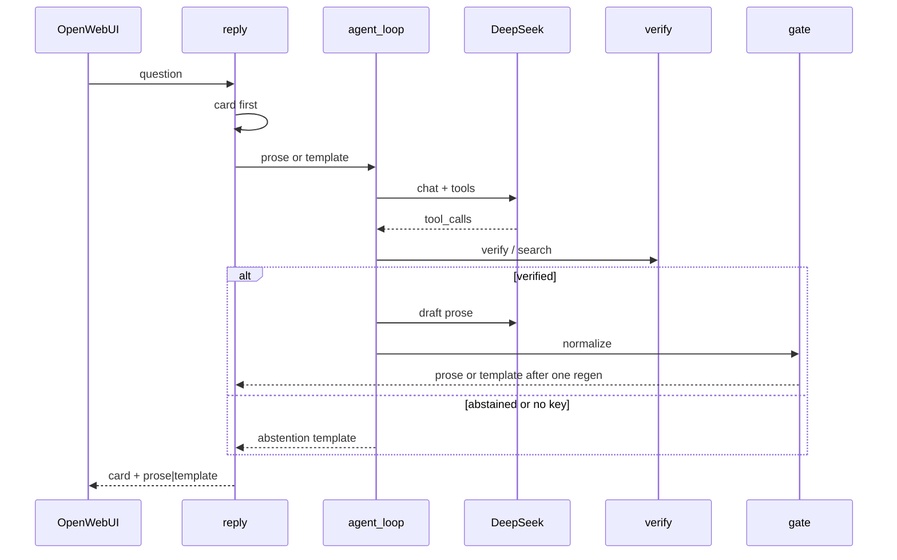

# Design: LLM tools host

## Technical Approach

Sibling `src/claimledger/agent/` (off the 13-path allowlist) owns tools, DeepSeek loop, host gate, normalize guard, and abstention template. `openwebui/reply.py` keeps card-first assembly and appends gated prose or the template. Named gap: no pinned stack component authorizes LLM financial prose or abstains via template. Specs under this change are not present yet; design aligns with `proposal.md`, `exploration.md`, and plan `llm_tools_host_732e4561`. Expected deltas: new `agent-host`; MODIFIED `openwebui-host` (card-first + host gate; Features Off unchanged).

## Architecture Decisions

| Decision | Options | Choice |
|----------|---------|--------|
| Package | Fold into `openwebui/` \| sibling `agent/` | **`agent/`** — matches `chart/`/`orchestrate/` |
| Tools MVP | verify+search \| +DocLang | **verify + search**; DocLang later |
| Loop host | Pipelines / OWUI tools \| CLAIMLEDGER | **Host executes `tool_calls`** |
| Model | local \| deepseek-flash @ api.deepseek.com | **deepseek-flash**; OpenAI-compatible HTTP |
| Truth / gate | prompt-only \| claims + `authorized_values` | **Host gate**; prompt is help only |
| Guard | widen `digits_ars` \| agent normalize | **agent normalize** — `digits_ars` rejects commas; dates/pages/periods exempt |
| Abstained | LLM prose \| template | **Spanish template only** |
| Unauthorized verified | reject forever \| regen once then template | **One regenerate, then template** |
| Missing API key | raise to UI \| abstention | **Abstention path**; no stack trace |
| Secrets / HTTP | hard pin \| `.env` + optional extra | **`.env` + compose inject**; optional `httpx`; `dependencies` `[]` |

## Data Flow

```
question → reply: recorded_book → execute|ask|measure → card[+crop|+chart]
         → agent loop (key present): DeepSeek tool_calls
              verify → {status, claims, authorized_values}
              search → {text, ref}  (never auth)
         verified + authorized_values ≠ [] → draft → normalize guard
              OK → append prose | fail → one regen → still fail → template
         abstained / no key / loop failure → Spanish abstention template
Open WebUI draws the assembled string only.
```



## File Changes

| File | Action | Description |
|------|--------|-------------|
| `src/claimledger/agent/__init__.py` | Create | Package marker |
| `src/claimledger/agent/tools.py` | Create | `verify` / `search` handlers + schemas |
| `src/claimledger/agent/normalize.py` | Create | Financial forms → canonical; metadata exempt |
| `src/claimledger/agent/gate.py` | Create | Allow only hits in `authorized_values` |
| `src/claimledger/agent/template.py` | Create | Stable Spanish abstention constant |
| `src/claimledger/agent/client.py` | Create | DeepSeek HTTP (`DEEPSEEK_API_KEY`) |
| `src/claimledger/agent/loop.py` | Create | Tool loop; missing key → template path |
| `src/claimledger/openwebui/reply.py` | Modify | Card first + gated prose OR template |
| `docker-compose.yml` | Modify | Inject `DEEPSEEK_API_KEY` into `claimledger` |
| `.env.example` | Modify | Document empty key placeholder |
| `pyproject.toml` | Modify | Optional HTTP extra |
| `tests/agent/*` | Create | Tools, normalize, gate, loop (mock) |
| `tests/openwebui/test_host.py` | Modify | Card + prose/template evals |

**OUT:** `query.py`, `ledger.py`, gold, `identity_key`, Neo4j, VLM, Pipelines, DocLang tool.

## Interfaces / Contracts

```python
# verify — agent-facing projection of QueryResult (do not edit query.py)
{"status": "verified"|"abstained", "claims": [...], "authorized_values": ["21262335"]}
# search — evidence only (no status / authorized_values)
{"hits": [{"text": str, "ref": str}]}
ABSTENTION_TEMPLATE: str  # Spanish; ME ABSTENGO register
```

`authorized_values` = verified `claims[].value` (`^-?\d+$`). Empty ⇒ abstained path. Normalize strips `$`/spaces; accepts thousand dots/commas → canonical; exempt dates, pages, period labels.

## Testing Strategy

| Layer | What | Approach |
|-------|------|----------|
| Unit | tools, normalize, gate, template | pytest; no network; stub book/retrieve |
| Unit | loop / client | mock DeepSeek; missing key → template, no traceback |
| Integration | `reply` | card first; verified prose; abstained template; Features Off |
| Evals | YPF / recipe_no_extract / metadata | Slice D; unauthorized → regen once → template |
| Kernel | unchanged | Network/docling-free |

## Threat Matrix

N/A — no routing, shell, subprocess, VCS/PR, executable-file, or matrix process-integration boundary.

## Migration / Rollout

No migration. TDD slices A–D (chained PRs likely). Rollback: delete `agent/` + tests; restore card-only `reply`; drop compose env and HTTP extra.

## Open Questions

- [x] Abstention — stable Spanish constant matching host voice
- [x] Unauthorized verified — one regenerate then template
- [x] Missing API key — abstention path, no stack trace to UI
- [ ] Exact template string (lock in apply RED fixture; `ME ABSTENGO` register)
