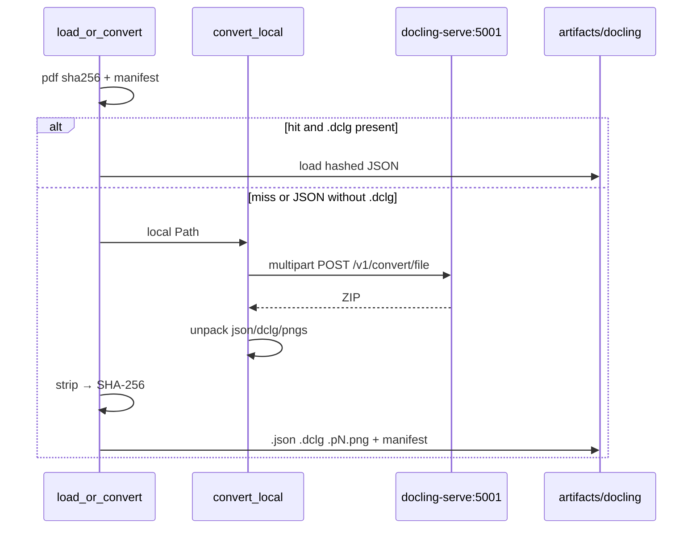

# Design: max-docling-parse

## Technical Approach

Docling Serve `v1.35.0` = offline **document compiler**. CLAIMLEDGER = **verification kernel** (hashed JSON → `extract_recipe` → Ledger → `query`). Convert is 100% `POST /v1/convert/file` (ZIP + `image_export_mode=referenced`). No embedded `DocumentConverter`, no `export_to_doclang`, no query-time serve. Delta: `docling-ingest`. Keep `extract_recipe` + `docling_core` until a follow-up.

## Architecture Decisions

| Decision | Choice | Rejected | Why |
|----------|--------|----------|-----|
| Boundary | Serve compiles; CLAIMLEDGER hashes/stores/verifies | Dual converters; optional serve | Approved plan; Architecture Gate |
| Transport | httpx multipart → ZIP referenced | In-process Docling; `/v1/convert/source` | Local Path only; remote-off seal |
| DocLang | ZIP bytes only; missing `.dclg` ⇒ recompile | `doclang_from_payload` backfill | One compiler SoT |
| PNGs | ZIP → `{hash}.p{n}.png` | `last_page_pngs` / PIL | Referenced export |
| Pin | Smoke `GET /version` | In-process `version("docling")` on convert | Pin lives in the image |
| httpx | `httpx==0.28.1` in `[docling]` (keep `[deepseek]`) | DeepSeek-only; root deps | Ingest tests use `.[docling]`; kernel empty |
| Compose query | No `depends_on` serve; data mount artifacts | `site-packages/docling` overlay | Query works with serve down |
| extract | Unchanged + `docling_core` | Pure-JSON extract now | Explicit follow-up |

## Data Flow

Runtime (no serve): hashed JSON → extract → Ledger → query.

## Compose

- Image: `quay.io/docling-project/docling-serve-cpu:v1.35.0`, port `5001`.
- Env: `DOCLING_SERVE_ENABLE_REMOTE_SERVICES=false`; UI off (`DOCLING_SERVE_ENABLE_UI=false` if present on pin).
- Healthcheck: `GET /version`.
- `claimledger`: **no** `depends_on` serve. Replace site-packages Docling mount with `./artifacts/docling:/app/artifacts/docling:ro`.
- Client env: `DOCLING_SERVE_URL` default `http://127.0.0.1:5001`.

## Client: `convert_local`

Returns `ConvertBundle` (`payload`, `doclang`, `page_pngs`). Lazy-import httpx. Thin `convert_pdf` MAY alias to `.payload`.

1. Non-`Path` / missing file → `IngestError` (never URL / `/v1/convert/source`).
2. Form seal — ON: `do_ocr=true`, `ocr_preset=rapidocr`, `ocr_lang=["es"]`, table accurate, picture classification, pdf heading hierarchy, include page/images, `image_export_mode=referenced`, `target_type=zip`, `to_formats` json+doclang. OFF: picture description, chart, code/formula enrichment, no `vlm_pipeline_*`.
3. Unpack: prefer `document.json`, `document.dclg`, `page-{n}.png`; lock regex after smoke if names differ.

## Store

Miss / missing `.dclg`: convert → `strip_page_pixels` → hash → write `.json`, ZIP `.dclg`, PNGs, manifest. Hit with both: load only. Remove `_ensure_doclang` / `doclang_from_payload`.

## Delete

From `parse.py` / `store.py` / Compose: `DocumentConverter` + pipeline options, `download_models` / `model_artifacts_path`, torch convert hack, `_require_pinned_docling`, `doclang_from_payload`, `last_page_pngs` / `_png_bytes` / memory sidecars, `site-packages/docling` mount.

## Stays

`extract_recipe` + `docling_core`; `.[docling]` for extract/graph; kernel; retrieval JSON reader; `docling-graph`.

## Errors

`IngestError` for bad Path, serve down, non-2xx, convert ≠ success, ZIP missing json/dclg, hash integrity. No embedded Docling fallback.

## File Changes

| File | Action | Description |
|------|--------|-------------|
| `src/claimledger/ingest/parse.py` | Modify | `convert_local` + ZIP; drop embedded compiler |
| `src/claimledger/ingest/store.py` | Modify | ZIP persist; no DocLang regen |
| `src/claimledger/ingest/types.py` | Modify | `ConvertBundle` if not private in parse |
| `docker-compose.yml` | Modify | serve service; data mount; no runtime depends_on |
| `pyproject.toml` | Modify | `httpx==0.28.1` in `[docling]` |
| `tests/ingest/test_store.py` (+ monkeypatches) | Modify | Mock ZIP; seal; no DocumentConverter/export; remote=false; URL reject; missing `.dclg` recompiles |
| `openspec/changes/max-docling-parse/specs/docling-ingest/spec.md` | Create | Delta (sdd-spec) |

## Testing

| Layer | What | Approach |
|-------|------|----------|
| Unit | Happy path | Mock httpx ZIP; seal; no DocumentConverter/export_to_doclang |
| Unit | Rejects / cache | Path/URL/`IngestError`; hit skips HTTP; missing `.dclg` recompiles |
| Kernel | Unchanged | No docling/httpx/network |
| Smoke | Pin + sample PDF | Checklist below |

### Smoke `/version` (manual; verify-report — not default pytest)

1. `docker compose up -d docling-serve` → `GET http://127.0.0.1:5001/version` require serve `1.35.0` + docling/slim `2.130.0` (not core/parse == 2.130.0).
2. One corpus PDF via `load_or_convert` → `.json` + `.dclg` + `.pN.png` + manifest.
3. Query with serve stopped still serves hashed artifacts.
4. Lock ZIP member names if they differ from `document.json` / `document.dclg` / `page-{n}.png`.

## Threat Matrix

N/A — no routing/shell/VCS/PR/executable-classification rows. Path-only + `IngestError` covered above.

## Migration

OCR-on may change hashes vs prior `do_ocr=False`. Recompile EEFF via serve; do not promote mixed local-export `.dclg`. No feature flag.

## Open Questions

- [ ] ZIP member names after first smoke.
- [ ] Confirm UI-off env name on `v1.35.0`.
